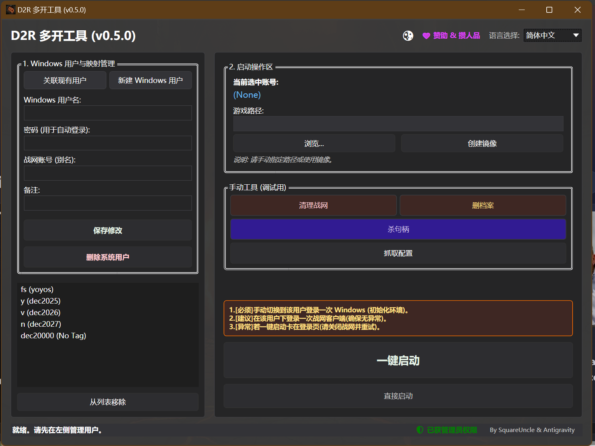

[ 简体中文 ](#cn) | [ English ](#en)

# D2RMultiplay v0.5.3

D2R 自动化多开与免验证登录工具。

## 🚀 核心方案

### 1. 免重复登录与验证
基于 **Windows 原生用户隔离**。不改文件，实现多账号免验证稳定登录。

### 2. D2R 多开限制突破
- **句柄 (Handle)**: 使用 C# 底层 API 自动清理 Mutex 互斥句柄。
- **目录 (Directory)**: 逻辑流程解决路径占用限制 —— **快照当前设置 ➔ 关闭战网 ➔ 杀掉 Mutex ➔ 还原设置**。实现单路径多开。

### 3. 用户体验
- **一键启动**: 登录一次，设置一次路径，后续直接一键丝滑启动。
- **暗黑模式**: 支持深色主题 (Dark Theme)，护眼且更沉浸。
- **多语言**: 界面支持中英文切换。

## 📖 界面指南

### 功能区域
- **左侧列表 (Left Panel)**: **账号管理**。用于创建和关联 Windows 隔离账号。每个账号对应一个独立的 Battle.net 实例。
- **右侧操作 (Right Panel)**: **启动控制**。包含游戏路径设置、配置文件快照管理以及启动按钮。
- **状态栏 (Status Bar)**: **系统状态**。显示是否具有管理员权限 (Admin Rights) 以及系统消息。

### 关键字段
- **Windows User**: **系统账号**。工具依赖 Windows 原生多用户机制来实现隔离。你需要为每个游戏账号创建一个对应的 Windows 账号。
- **Password**: **账号密码**。用于工具自动创建 Windows 账号或进行登录切换。密码仅加密存储在本地 `accounts.json` 中。
- **Game Path**: **游戏路径**。指定 `D2R.exe` 的位置。这里只是作为备注，没有任何实际意义，就是怕你忘了这个账户用的是什么路径的游戏。你也可以使用 "Mirror" 功能为每个账号创建虚拟路径。虚拟路径和真实路径的区别就是虚拟路径会让你所有的窗口都汇集在任务栏的一个窗口图标下面，真实路径会让你的窗口分散在任务栏的多个图标下面，你可以自主拉动窗口到你想要的顺序。
- **BattleTag**: **战网昵称**。仅作为列表显示的备注，方便你区分账号。
- **One-Click Launch**: **一键启动**。执行标准流程：**备份当前配置 -> 清理战网进程 -> 还原目标配置 -> 启动游戏**。

## 📦 版本说明

| 版本 | 说明 |
| :--- | :--- |
| **D2RMultiplay_v0.5.3_Green.zip** | **推荐**。解压即用，启动最快，兼容性最好。 |
| **D2RMultiplay_v0.5.3_Portable.zip** | 单文件版。只有一个 EXE，启动略慢（需释放临时环境）。 |
| **D2RMultiplay_v0.5.3.zip** | 依赖版。体积最小，需自行安装 .NET 10。 |

## 💡 提示与免责

- **权限**: 请以 **管理员权限** 运行，否则无法清理系统句柄。
- **误报**: 涉及句柄操作，如遇杀毒软件拦截请添加白名单。
- **风险**: 本工具仅供技术交流。使用产生的后果（如封号、损失）由用户自行承担。本项目与 Blizzard Entertainment 无关。

## 💰 支持

如果您觉得本工具有帮助，欢迎请作者喝杯咖啡！
- **捐赠**: 内置捐赠入口 (Alipay / WeChat / PayPal)。可点击界面右上角 ❤️ 图标查看。

---

[ 简体中文 ](#cn) | [ English ](#en)

# D2RMultiplay (English)

Automated multi-boxing and verification-free login tool for D2R.

## 🚀 Core Solutions

### 1. Persistent Login & Auth Bypass
Built on **Windows Native User Isolation**. No memory injection or file modification. Stable, verification-free login for multiple accounts.

### 2. D2R Multi-boxing Logic
- **Mutex**: Automatically cleared via low-level C# API.
- **Directory**: Single-path multi-boxing via automated workflow: **Snapshot config ➔ Close Bnet ➔ Kill Mutex ➔ Restore config**.

### 3. User Experience
- **One-Click**: Set up login and directory once. Seamless one-click launch thereafter.
- **Dark Mode**: Native dark theme support.

## 📖 Interface Guide

### Interface Areas
- **Left Panel**: **User Management**. Create and link Windows isolation accounts here.
- **Right Panel**: **Launch Controls**. Game path settings, config snapshots, and launch buttons.
- **Status Bar**: **System Status**. Shows Admin status and system messages.

### Key Fields
- **Windows User**: **System Account**. The tool relies on Windows native multi-user mechanism for isolation. You need one Windows user per game account.
- **Password**: **Account Password**. Used for auto-creation or login switching. Stored encrypted locally in `accounts.json`.
- **Game Path**: **Game Path**. Location of `D2R.exe`. This is primarily a reference note to remind you which path this account uses. You can also use the "Mirror" function to create virtual paths. **Difference**: "Virtual Paths" group all windows under one taskbar icon, while "Real Paths" separate windows into individual icons, allowing you to rearrange window order manually.
- **BattleTag**: **BattleTag**. Display remark only, helping you identify accounts in the list.
- **One-Click Launch**: **Standard Workflow**: Backup config -> Clean processes -> Restore target config -> Launch game.

## 📦 Releases

| Version | Description |
| :--- | :--- |
| **D2RMultiplay_v0.5.3_Green.zip** | **Recommended**. Ready to run, fastest launch, best compatibility. |
| **D2RMultiplay_v0.5.3_Portable.zip** | Single-file version. Slower startup (needs to extract runtime). |
| **D2RMultiplay_v0.5.3.zip** | Dependent version. Smallest size, requires .NET 10 installed. |

## 💡 Tips & Disclaimer

- **Privilege**: Run as **Admin** required to clear system handles.
- **False Positive**: Anti-virus software might flag handle operations; please whitelist if necessary.
- **Risk**: Use at your own risk. Not affiliated with Blizzard Entertainment.

## 💰 Support

If you find this tool helpful, consider buying me a coffee!
- **Donation**: Built-in support (Alipay / WeChat / PayPal). Click the ❤️ icon in the top right.

---

**GitHub:** [https://github.com/yoyoset/D2RMutiplay](https://github.com/yoyoset/D2RMutiplay)